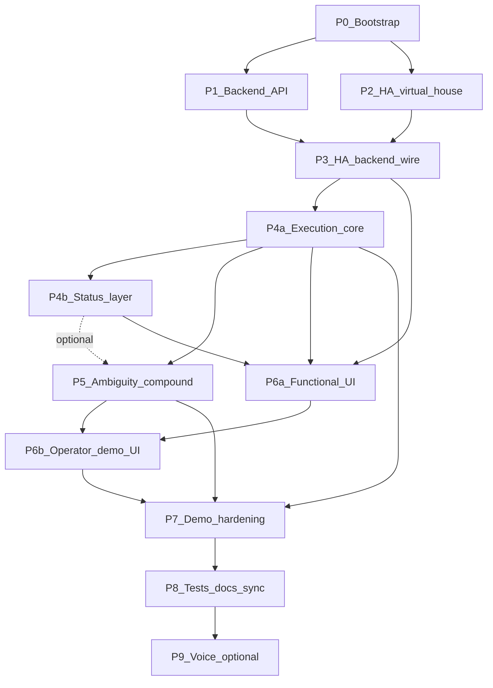

# Phased implementation plan (Smart Home Voice MVP)

**Статус:** утверждён (Approved with minor editorial notes, без блокирующих замечаний). Следующий шаг реализации: **P0** без расширения scope и без изменения стратегических инвариантов.

Контракт: [prompts/master-prompt.md](../prompts/master-prompt.md), [AGENTS.md](../AGENTS.md), [.cursor/rules/](../.cursor/rules/), [docs/architecture.md](../docs/architecture.md), [docs/api-contracts.md](../docs/api-contracts.md), [docs/intent-catalog.md](../docs/intent-catalog.md), [docs/demo-script.md](../docs/demo-script.md), [docs/acceptance-checklist.md](../docs/acceptance-checklist.md). Текущее состояние репозитория — только правила и документация; каталогов приложения ещё нет.

### Стратегические инварианты (не менять при реализации плана)

- **Home Assistant** — single source of truth для дома/сущностей.
- **FastAPI backend** — владелец бизнес-логики, сценариев, ambiguity, ответов и event log (YAML в `ha/` — только integration/config); **HTTP/route handlers и intent handlers** — только делегирование, **без доменных правил** (см. P4a).
- **UI** — controlled presentation and interaction layer, не второй SoT.
- **Text-first**, text fallback обязателен; **голос** — опциональное расширение после стабильного text E2E.
- **Clarification-first** для неоднозначных команд; **детерминированный demo mode** для воспроизводимых показов.

### Сопоставление с staged prompts

| Этап плана | Промпт Cursor                                                                     | Примечание                                                   |
| ---------- | --------------------------------------------------------------------------------- | ------------------------------------------------------------ |
| P0         | [prompts/00-bootstrap.md](../prompts/00-bootstrap.md)                             | Каркас репо, без полной сценарной логики                     |
| P1         | [prompts/01-backend.md](../prompts/01-backend.md)                                 | Baseline API + тесты на эндпоинты                            |
| P2         | [prompts/02-home-assistant.md](../prompts/02-home-assistant.md)                   | HA как SoT, тонкий YAML                                      |
| P6a–P6b    | [prompts/03-ui.md](../prompts/03-ui.md)                                           | Сначала functional UI, затем operator/demo                   |
| P4a–P4b–P5 | [prompts/04-scenarios-and-ambiguity.md](../prompts/04-scenarios-and-ambiguity.md) | Execution core, status layer, затем ambiguity и compound     |
| P8         | [prompts/05-tests-and-docs.md](../prompts/05-tests-and-docs.md)                   | Синхронизация тестов и docs с кодом                          |
| P7         | [prompts/06-demo-hardening.md](../prompts/06-demo-hardening.md)                   | Полноценный replay/set-mode/детерминизм поверх раннего reset |

---

## Зависимости между этапами

### Явная сводка зависимостей

| Этап | Зависит от                                        | Комментарий                                                                                                                                                               |
| ---- | ------------------------------------------------- | ------------------------------------------------------------------------------------------------------------------------------------------------------------------------- |
| P3   | P1, P2                                            | HA read/write path без дублирования SoT в backend                                                                                                                         |
| P4a  | P3                                                | Императивное выполнение + единый execution response + минимальный baseline reset                                                                                          |
| P4b  | P4a                                               | Status intents отдельно от execution core (можно сузить подмножество)                                                                                                     |
| P5   | **P4a** (обязательно); **P4b** (желательно)       | Ambiguity/clarify для **execution** требует только P4a; P4b не жёсткий блокер. P4b расширяет сценарии (clarify/status, compound со status-ногой). Контракт ответа из P4a. |
| P6a  | P3, P4a (желательно и P4b для статусов в консоли) | Functional UI без operator-слоя                                                                                                                                           |
| P6b  | P5, P6a                                           | Clarification UI, debug trace, demo controls                                                                                                                              |
| P7   | P4a, P5, P6b                                      | Полноценный replay, `set-mode`, детерминизм; расширение минимального reset из P4a                                                                                         |
| P8   | P5–P7                                             | Тесты и docs по фактическому поведению                                                                                                                                    |
| P9   | P8 (желательно)                                   | Голос вне критического MVP path                                                                                                                                           |

- **P0** обязателен для всех последующих этапов.
- **P1** и **P2** можно вести параллельно после P0; **P3** требует и HA-конфига, и каркаса backend.
- **P6a** возможен, когда стабильны `GET /api/state/house` и **P4a** execute; **P6b** — после **P5** (clarify в UI) и базового **P6a**.
- **Минимальный baseline reset (API)** — часть **P4a** (не позже), чтобы отладка P3–P4a и тесты не были хрупкими; **P7** расширяет сброс и добавляет replay/set-mode/детерминизм.
- **P5** после **P4a** можно начинать для execution-неоднозначности; **P4b** догонять параллельно или позже — без блокировки P5.

### Документация контрактов (api-contracts)

- После **P4a** и **P4b**: **минимально** обновить [docs/api-contracts.md](../docs/api-contracts.md) — execution/status response, статусы `success` / `error` / `clarification_required`, ключевые поля trace (чтобы не было расхождения «код vs дока» уже на интеграции).
- **P8**: финальная **полная** синхронизация всех каноничных docs (включая полный проход по [docs/api-contracts.md](../docs/api-contracts.md)) с фактическим поведением.

---

## Этапы: цели и конкретные файлы

### P0 — Bootstrap и репозиторный каркас

**Цель:** один способ поднять стек локально; пустые/минимальные сервисы; единый README «как запустить MVP», не противоречащий [docs/setup.md](../docs/setup.md).

**Файлы (создать/существенно изменить):**

| Файл / каталог                                                                                                                                               | Назначение                                                                                        |
| ------------------------------------------------------------------------------------------------------------------------------------------------------------ | ------------------------------------------------------------------------------------------------- |
| [docker-compose.yml](../docker-compose.yml)                                                                                                                  | Сервисы: `homeassistant`, `backend`, `ui`; сеть, volumes для `ha/`, переменные                    |
| [.env.example](../.env.example)                                                                                                                              | `HA_URL`, токен/long-lived (placeholder), порты, режим демо при необходимости                     |
| [.gitignore](../.gitignore)                                                                                                                                  | Python, Node, `.env`, артефакты HA                                                                |
| [backend/requirements.txt](../backend/requirements.txt)                                                                                                      | FastAPI, Pydantic, httpx/websockets (по выбору интеграции), uvicorn, pytest                       |
| [backend/app/main.py](../backend/app/main.py) (или `backend/src/...`)                                                                                        | Минимальное приложение + только `GET /api/health`                                                 |
| [backend/tests/test_health.py](../backend/tests/test_health.py)                                                                                              | Один дымовой тест                                                                                 |
| [ui/package.json](../ui/package.json), [ui/vite.config.ts](../ui/vite.config.ts), [ui/tsconfig.json](../ui/tsconfig.json), [ui/index.html](../ui/index.html) | Vite + React + TS                                                                                 |
| [ui/src/main.tsx](../ui/src/main.tsx), [ui/src/App.tsx](../ui/src/App.tsx)                                                                                   | Заглушка «подключение к API»                                                                      |
| [ha/configuration.yaml](../ha/configuration.yaml)                                                                                                            | Минимум: `default_config:` или эквивалент, `homeassistant: packages: !include_dir_named packages` |
| [ha/packages/.gitkeep](../ha/packages/.gitkeep) или первый пакет-заглушка                                                                                    | Зарезервировать структуру пакетов                                                                 |
| [tools/.gitkeep](../tools/.gitkeep)                                                                                                                          | Закрыть структуру из master prompt                                                                |
| [README.md](../README.md)                                                                                                                                    | Заменить/расширить: запуск через `docker compose`, ссылки на [docs/setup.md](../docs/setup.md)    |

**Зависимости:** нет (старт).

**Инфра-заметка:** в [docker-compose.yml](../docker-compose.yml) заложить устойчивый порядок готовности HA (`depends_on`, healthcheck и/или retry в entrypoint backend), чтобы при интеграции в P3 не ловить гонки «backend раньше, чем HA поднял сущности».

---

### P1 — Backend: контракт API и внутренние сервисы-заглушки

**Цель:** все эндпоинты из [docs/api-contracts.md](../docs/api-contracts.md) объявлены и отвечают типизированными моделями; event log и scenario engine — **скелеты** (in-memory), без полной бизнес-логики.

**Файлы (типовая раскладка, имена можно уточнить при реализации):**

- `backend/app/api/routes/health.py`, `state.py`, `events.py`, `intents.py`, `demo.py`
- `backend/app/models/*.py` — доменные и API Pydantic-модели (intent payload из контракта)
- `backend/app/services/event_log.py` — кольцевой буфер событий
- `backend/app/services/scenario_engine.py` — заглушка / делегирование «not implemented» с осмысленным HTTP
- `backend/tests/` — тесты на health, пустой/стабовый `state/house`, `events`, заглушки POST

**Зависимости:** P0.

**Связь с промптами:** соответствует [prompts/01-backend.md](../prompts/01-backend.md) (baseline + тесты на эндпоинты).

---

### P2 — Home Assistant: виртуальный дом (3 комнаты), сцены, тонкая проводка

**Цель:** Home Assistant — единственный SoT для сущностей; три комнаты и виртуальные устройства; сцены; YAML только как интеграция ([.cursor/rules/03-home-assistant-boundaries-mdc.mdc](../.cursor/rules/03-home-assistant-boundaries-mdc.mdc)).

**Файлы (из [prompts/02-home-assistant.md](../prompts/02-home-assistant.md)):**

- [ha/configuration.yaml](../ha/configuration.yaml) — доработка под пакеты, при необходимости `intent_script` / conversation
- [ha/intent_script.yaml](../ha/intent_script.yaml)
- [ha/scenes.yaml](../ha/scenes.yaml)
- [ha/packages/living_room.yaml](../ha/packages/living_room.yaml)
- [ha/packages/kitchen.yaml](../ha/packages/kitchen.yaml)
- [ha/packages/bedroom.yaml](../ha/packages/bedroom.yaml)
- [ha/custom_sentences/ru/control_device.yaml](../ha/custom_sentences/ru/control_device.yaml)
- [ha/custom_sentences/ru/scene_control.yaml](../ha/custom_sentences/ru/scene_control.yaml)
- [ha/custom_sentences/ru/status_queries.yaml](../ha/custom_sentences/ru/status_queries.yaml)

**Зависимости:** P0 (volume и compose уже знают путь к `ha/`).

---

### P3 — Интеграция: backend читает/пишет HA (без дублирования состояния)

**Цель:** `GET /api/state/house` строится из состояния сущностей HA; действия выполнения позже вызывают HA REST (или WebSocket API) — без второй модели «истины» в backend ([docs/architecture.md](../docs/architecture.md)).

**Файлы:**

- `backend/app/services/ha_client.py` (или `integrations/home_assistant.py`) — конфиг из env, ошибки/таймауты
- `backend/app/services/house_state.py` — маппинг entity_id → нормализованный дом для UI
- Обновление роутов `state` / частично `execute` (если уже вызывают HA для простых команд)

**Зависимости:** P1 + P2 (HA с поднятыми сущностями).

**Примечание к интеграции:** как только в P3 стабилен write path в HA, можно начинать сцену/script baseline в HA; финальная привязка к **минимальному reset** оформляется в **P4a** (см. ниже), чтобы не блокировать P3 чистым чтением состояния.

---

### P4a — Execution core (императивные команды и единый контракт ответа)

**Цель:** отделить **императивное выполнение** от status-логики (P4b). Реализовать `turn_on_device`, `turn_off_device`, `activate_scene`; пути success/error; запись в event log; **единый execution response contract**, пригодный для UI, debug trace и будущего clarification **без смены формы API** в P5.

**Архитектура вызова (жёстко, чтобы не раздувать `scenario_engine`):**

- **Intent handler registry / router:** таблица `normalized_intent` → handler; **HTTP/API route handlers** и тонкие entrypoints только делегируют в orchestration layer и **не содержат бизнес-логики и доменных правил** (ветвления «если комната X — …» только вне handlers).
- `**scenario_engine` — только orchestration:** маршрутизация по intent, вызов `entity_resolver` → handler pipeline, сборка результата через `response_builder`; без накопления доменных правил в одном «толстом» файле.
- `**entity_resolver` (каноническое имя модуля):** единая точка для алиасов и слабых entity-полей из payload → **канонические** цели (`room`, `device`, `entity_id` в доменной модели). **Ambiguity (P5)** работает **по каноническим кандидатам** из `entity_resolver`, а не по сырой строке utterance как основному режиму.

**Обязательные элементы модели ответа (Pydantic / модули):**

- `backend/app/services/response_builder.py` — **обязателен**, не опционален.
- Типы (имена могут быть слегка иными, смысл фиксирован): `ExecutionResponse`, `DebugTrace`, `AffectedEntity`, `StateChange`, таксономия `ScenarioError` (классификация ошибок для UI и логов).
- Поле **статуса выполнения верхнего уровня** с минимумом трёх значений: `success`, `error`, `clarification_required` (полная ambiguity-логика остаётся в P5, но форма ответа и ветка `clarification_required` закладываются здесь, чтобы не переписывать контракт позже).

**Минимальный baseline reset (ранний, технический):**

- В рамках **P4a** реализовать **минимальный** `POST /api/demo/reset`: восстановление HA baseline (сцена/script/последовательность вызовов HA), запись в event log, обновление нормализованного `GET /api/state/house`.
- Это **не** замена P7: без полного replay, без финальной семантики `set-mode`, без polish демо-UX. P7 **расширяет** тот же endpoint/сервис или добавляет поведение поверх уже стабильного baseline.

**Файлы (типовая раскладка):**

- `backend/app/intents/registry.py` (или `handlers/registry.py`) — маппинг `normalized_intent` → handler callable / класс
- `backend/app/intents/handlers/*.py` — **только делегирование**: вызов сервисов / HA adapter по уже разрешённым целям; **без доменных правил** и без тяжёлой оркестрации
- `backend/app/services/entity_resolver.py` — алиасы и входные entity-поля → canonical targets; до execution и до передачи кандидатов в ambiguity (P5)
- `backend/app/services/scenario_engine.py` — **только** orchestration (router + resolver + handlers + event log hooks)
- `backend/app/services/response_builder.py` — сборка `ExecutionResponse` + `DebugTrace` + ошибок
- `backend/app/models/execution.py` (или в составе `models/`) — контракт типов
- `backend/app/api/routes/demo.py` — минимальный reset (если не вынесено в `demo_controller` сразу)
- `backend/tests/test_execution_flows.py` — поведенческие тесты on/off/scene + отражение в state

**Зависимости:** P3.

#### Definition of Done (P4a)

Этап считается завершённым, если:

- backend выполняет `turn_on_device`, `turn_off_device`, `activate_scene` через HA (SoT);
- используется **единый execution response contract** (`ExecutionResponse` + обязательные вложения для trace/side-effects/errors);
- `response_builder` участвует во всех execution-ответах;
- event log фиксирует success/error (и задел под clarification-события той же схемой);
- результат выполнения **виден** в `GET /api/state/house` после команды;
- реализован **минимальный** `POST /api/demo/reset` (baseline HA + лог + согласованность state);
- есть поведенческие тесты на базовые execution flows;
- **route handlers и intent handlers не содержат бизнес-логики и доменных правил** (только делегирование в orchestration/services); оркестрация в `scenario_engine`, доменные правила — в `entity_resolver` / dedicated services / HA adapters, не в HTTP-слое и не в handler-теле.

---

### P4b — Status layer (запросы состояния)

**Цель:** вынести **read-oriented** логику из execution core: `get_room_status`, `get_device_status`, `get_sensor_status`; агрегирование из HA; отдельное форматирование **status response** (краткий UX-friendly текст/структура для UI), не смешивая с imperative execution в одном «толстом» `scenario_engine`.

**Файлы (типовая раскладка):**

- `backend/app/services/status_service.py` (или `query_engine.py`) — сборка статусов из `house_state` / HA
- `backend/app/services/response_builder.py` — отдельные фабрики/methods для status-ответов **в том же семействе контрактов**, что и execution (общий корень при необходимости), но без исполнения команд
- `backend/tests/test_status_queries.py` — поведенческие тесты

**Зависимости:** P4a.

**Упрощение MVP:** допускается в P4b сначала **один** room status и **один** sensor status; остальные комнаты/датчики — итеративно.

#### Definition of Done (P4b)

Этап считается завершённым, если:

- backend поддерживает `get_room_status`, `get_device_status`, `get_sensor_status` (хотя бы в согласованном минимальном подмножестве сущностей);
- ответы строятся из **фактического** HA state;
- ответы содержат краткий UX-friendly вывод;
- есть поведенческие тесты на status queries (в объёме реализованного подмножества);
- **status queries не мутируют состояние** (read-only путь, без побочных вызовов `turn_on` и т.п.) и **детерминированы** при неизменном HA state (повторный запрос даёт согласованный результат).

---

### P5 — Неоднозначность, compound, clarify (continuation)

**Цель:** clarification-first; полноценный `ambiguity_resolver`; `POST /api/intents/clarify`; `compound_action`; относительные фразы («теплее») — уточнение или безопасный ответ; события в event log. Опирается на **уже существующую** форму ответа с `clarification_required` из P4a. **Ambiguity resolver** получает **канонических кандидатов** из `**entity_resolver`** (P4a); не сравнивает «сырые» строки как основной режим.

**Зависимости:** **P4a** — обязательно. **P4b** — желателен (status-ветки compound, clarify по датчикам/комнатам), но **не блокирует** ввод P5 для execution-only неоднозначности.

**Session / continuation model (явно для MVP):**

- **session_id policy:** брать из `meta.session_id` входного запроса; если отсутствует — генерировать стабильный id на сессию UI-клиента и возвращать клиенту в ответе, чтобы последующий `clarify` использовал тот же id.
- **Хранилище pending clarification:** in-memory dict/map по `session_id` (достаточно для локального MVP).
- **TTL:** задать явное значение (например 5–15 минут — конкретное число зафиксировать в коде/конфиге при реализации); по истечении запись удаляется.
- **Что хранится в continuation context:** нормализованный черновик intent, список кандидатов (ids сущностей/комнат), исходный utterance, correlation id, timestamp.
- **Ответ после TTL:** `clarify` возвращает осмысленную ошибку `session_expired` / `clarification_expired` (в таксономии `ScenarioError` и в user-facing message), без молчаливого гадания.
- **Несовпадение типа ответа:** если пришёл не тот payload для текущего шага уточнения — безопасный отказ + подсказка + событие error в логе.

**Файлы:**

- `backend/app/services/ambiguity_resolver.py`
- `backend/app/services/clarification_store.py` (или модуль внутри resolver) — TTL, очистка
- `backend/app/services/scenario_engine.py` — ветвления continuation/compound
- `backend/tests/test_ambiguity.py`, `test_compound.py`, `test_clarification_ttl.py` (или эквивалент)

---

### P6a — Functional UI (React + TS + Vite)

**Цель:** первый полезный UI-слой без operator-панелей: дашборд, комнаты/устройства, event log, command console. Данные состояния **только** с backend ([prompts/03-ui.md](../prompts/03-ui.md), [.cursor/rules/04-ui-and-demo-mdc.mdc](../.cursor/rules/04-ui-and-demo-mdc.mdc) — подмножество зон).

**Файлы (типовая структура):**

- `ui/src/api/client.ts`
- `ui/src/components/Dashboard.tsx`, `RoomsDevices.tsx`, `EventLog.tsx`, `CommandConsole.tsx`
- `ui/src/App.tsx` — компоновка P6a

**Зависимости:** P3; для осмысленной консоли — **P4a** (execute) и желательно **P4b** (status). CORS/proxy в Vite или единый origin в compose.

---

### P6b — Operator / demo UI

**Цель:** слой для демонстрации и отладки: clarification panel, debug trace (чтение `DebugTrace` из контракта ответа), demo controls (в т.ч. связь с **минимальным reset** из P4a и последующими P7-фичами), явная видимость сбоев.

**Файлы:**

- `ui/src/components/ClarificationPanel.tsx`, `DebugTrace.tsx`, `DemoControls.tsx`
- доработка `ui/src/App.tsx` — встраивание P6b рядом с P6a

**Зависимости:** P5 и P6a (clarify и trace осмысленны после них).

---

### P7 — Demo hardening: replay, set-mode, детерминизм

**Цель:** полноценные **demo-oriented** возможности поверх раннего baseline reset: `POST /api/demo/replay`, `POST /api/demo/set-mode` с чёткой семантикой (static/live/simulator или принятое в проекте разбиение), детерминированный demo mode, полировка сценария сброса в связке HA + event log + UI ([prompts/06-demo-hardening.md](../prompts/06-demo-hardening.md)).

**Файлы:**

- `backend/app/services/demo_controller.py` (расширение логики поверх P4a reset)
- доработки `ha/` (сцены/scripts под replay, режимы при необходимости)
- UI: индикатор режима, кнопки replay/set-mode, связка с **P6b** demo controls

**Зависимости:** P4a (базовый reset), P5, P6b.

---

### P8 — Тесты и синхронизация документации

**Цель:** покрытие нетривиальной логики ([.cursor/rules/05-testing-and-docs-mdc.mdc](../.cursor/rules/05-testing-and-docs-mdc.mdc)); приведение каноничных docs и README в соответствие с фактическим поведением ([prompts/05-tests-and-docs.md](../prompts/05-tests-and-docs.md)).

**Файлы:** преимущественно `backend/tests/`**; полная синхронизация каноничных docs: [docs/api-contracts.md](../docs/api-contracts.md), [docs/architecture.md](../docs/architecture.md), [docs/intent-catalog.md](../docs/intent-catalog.md), [docs/setup.md](../docs/setup.md), [docs/demo-script.md](../docs/demo-script.md), [docs/acceptance-checklist.md](../docs/acceptance-checklist.md), [README.md](../README.md).

**Зависимости:** P5–P7 (clarify/compound, полноценный demo replay/set-mode поверх раннего reset; синхронизация контракта execution/status из P4a/P4b).

---

### P9 — Голос / Assist (опционально)

**Цель:** выполнить формулировку DoD из master prompt: «минимально работает **или** безопасно подготовлено» без поломки текстового пути — тонкая настройка HA Assist / pipeline, без кастомного STT/TTS/NLU.

**Файлы:** доп. YAML в `ha/`, возможно заметки в [docs/demo-script.md](../docs/demo-script.md) (fallback на текст).

**Зависимости:** P8 желательно; можно начинать после P2 параллельно, но для стабильности лучше после text E2E.

---

## Пути поставки: engineering smoke vs demo-ready

Общие условия: локальный запуск, 3 комнаты, **без голоса** (P9 вне критического path); **P4b** допускается в **minimum subset**; после P4a/P4b — см. раздел **«Документация контрактов»** выше для [docs/api-contracts.md](../docs/api-contracts.md).

### Engineering smoke path

**Цель:** быстро доказать HA ↔ backend ↔ UI и устойчивость прогонов без полного продуктового слоя.

#### Базовый engineering smoke (без P5)

**Цепочка:** `P0 → P2 → P1 → P3 → P4a → P6a → (проверенный вызов минимального reset из P4a) → выборочно P8`

- Нет clarify/compound в объёме smoke; только execute + state + events + reset.

#### Расширенный engineering smoke (с P5)

**Цепочка:** `P0 → P2 → P1 → P3 → P4a → P6a → (reset из P4a) → P5 → выборочно P8`

- **P4b** можно **опустить** или выполнить позже — **не блокер** для P5 на execution-неоднозначности.
- **P6b / P7** не обязательны для smoke; reset — через API P4a (curl/скрипт), не обязательно через UI.

### Demo-ready path

**Цель:** показ по [docs/demo-script.md](../docs/demo-script.md): clarification, trace, replay/set-mode, детерминизм.

**Цепочка:**

`P0 → P2 → P1 → P3 → P4a → P4b (minimum subset или полнее) → P6a → (reset зафиксирован в процедуре демо) → P5 → P6b → P7 (ядро) → P8`

- **P4b** — желателен до финального демо (статусы в консоли и сценарии со status).
- **P6b / P7** — обязательны для полноценного demo-ready (см. также раздел **Demo-critical** ниже).

**Каноническая объединённая ссылка (для ориентира):** `P0 → P2 → P1 → P3 → P4a → [P4b по необходимости] → P6a → early baseline reset → [P5 → P6b → P7] → P8` — ветвление «smoke vs demo» см. выше.

Узкий критерий «готово к первому *продуктовому* демо» (demo-ready): compose up, HA с сущностями, backend отдаёт house state из HA, execute/status отвечают единым контрактом, текстовая команда меняет HA и отражается в UI, в логе есть запись, **baseline reset** восстанавливает эталон, **сценарий неоднозначности с уточнением** проходит согласно [docs/demo-script.md](../docs/demo-script.md).

---

## Что можно отложить

- **Demo-ready path:** не откладывать **P5**, **P6b** и **ядро P7**, если цель — показ из [docs/demo-script.md](../docs/demo-script.md). **Минимальный reset** не откладывать за P4a.
- **Базовый engineering smoke:** без **P5** — см. подраздел выше; **P6b** и **P7** не нужны.
- **Расширенный engineering smoke:** с **P5**; **P4b**, **P6b**, **P7** по-прежнему можно не делать до перехода на demo-ready.
- **После интеграционного smoke:** полный охват P4b (все комнаты/датчики), `set_brightness`, `set_temperature`, расширенные compound-пары.
- Папка [tools/](../tools/) с осмысленными скриптами (smoke, seed) — после стабилизации URL/портов.
- Продвинутый replay (длинный сценарий, ветвление) — после короткого фиксированного сценария в P7.
- P9 голос и глубокая настройка Assist — вне минимального MVP path.
- Визуальный «полиш» UI — после инженерной полноты P6a/P6b.

---

## Demo-critical (для устойчивого показа по [docs/demo-script.md](../docs/demo-script.md))

- **Текстовый ввод** всегда доступен и обходит сбои голоса.
- **Единый контракт ответа** (P4a) с `DebugTrace` и статусами `success` / `error` / `clarification_required` — чтобы UI и P5 не расходились с API.
- **Детерминированность:** фиксированный baseline после reset (ранний reset в P4a, углубление в P7); предсказуемый replay.
- **Видимая трассировка** в **P6b:** utterance → normalized intent → entities → ответ → состояние ([.cursor/rules/04-ui-and-demo-mdc.mdc](../.cursor/rules/04-ui-and-demo-mdc.mdc)).
- **Event log** в **P6a** и в API.
- **Один кейс неоднозначности** («Выключи свет») с clarification и продолжением — якорь демо (требует **P5**, **P6b**, контракт из **P4a**).
- **Быстрый recovery:** минимальный reset из P4a + полноценные контролы в P6b/P7; restart compose в README; fallback голоса → текст в [docs/demo-script.md](../docs/demo-script.md).

---

Следующий шаг — реализация **P0** (скелет файлов без полной сценарной логики), без кода вне согласованных файлов списка, без расширения scope и без изменения стратегических инвариантов.